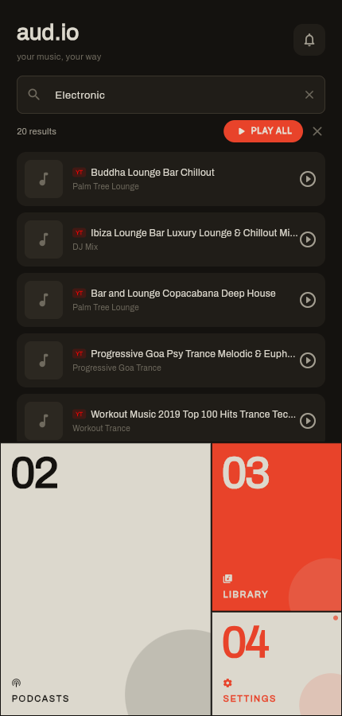
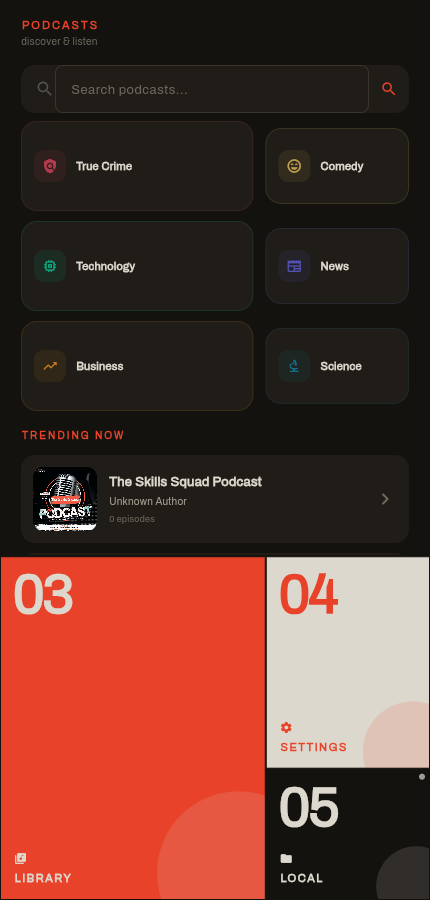
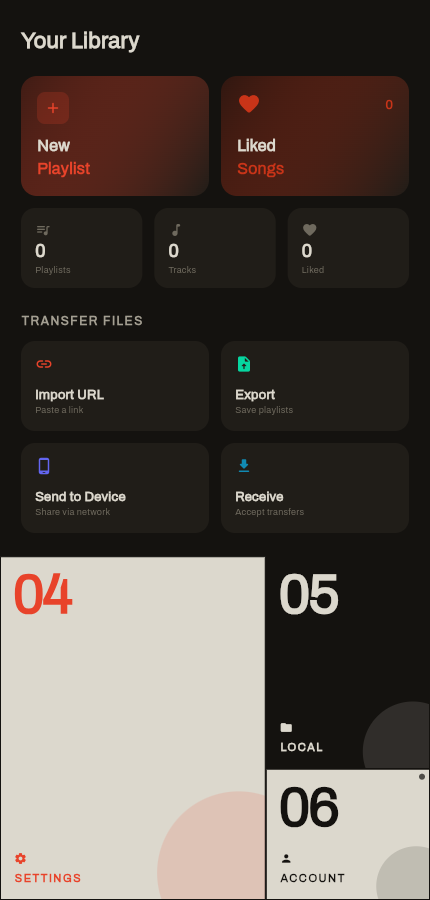
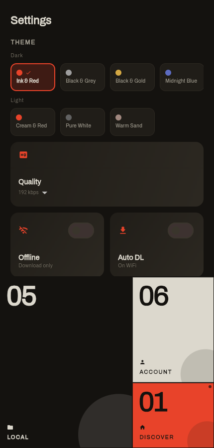
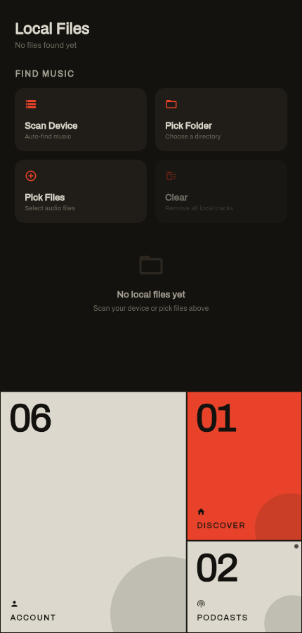
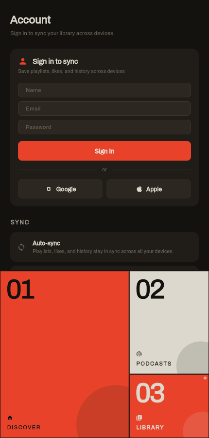

# aud.io

You know that thing where you want to listen to music but every app is either bloated, ugly, or wants your firstborn? Yeah, we fixed that.

**aud.io** is a music player that respects your eyeballs. Built with Flutter. Searches YouTube Music, SoundCloud, and podcasts — without selling your soul. No backend, no Cloudflare, no Render. Just GitHub.

[](https://flutter.dev)
[](https://dart.dev)
[](LICENSE)
[](https://github.com/0giinn0/Aud.io/actions)
[](https://github.com/0giinn0/Aud.io/releases/latest/download/aud-io.apk)
[](https://github.com/0giinn0/Aud.io/releases)

---

## Download

| Platform | Link | Install |
|----------|------|---------|
| **Android APK** | [releases/latest/download/aud-io.apk](https://github.com/0giinn0/Aud.io/releases/latest/download/aud-io.apk) | Allow "Install unknown apps" for your browser → open the file |
| **iOS (.app)** | [releases/latest/download/aud-io-ios.zip](https://github.com/0giinn0/Aud.io/releases/latest/download/aud-io-ios.zip) | Sideload via [Sideloadly](https://sideloadly.io/) or [AltStore](https://altstore.io/) with your Apple ID |
| **Web app** | [0giinn0.github.io/Aud.io](https://0giinn0.github.io/Aud.io) | Just open the link |
| **Landing page** | [0giinn0.github.io/Aud.io/download/](https://0giinn0.github.io/Aud.io/download/) | Download buttons for both platforms |
| **All releases** | [github.com/0giinn0/Aud.io/releases](https://github.com/0giinn0/Aud.io/releases) | — |

### Install the APK (Android)

1. Tap the download link above on your Android phone — the APK is named `aud-io.apk`.
2. If prompted, allow your browser to **install unknown apps** (Settings → Apps → your browser → Install unknown apps → Allow).
3. Open the downloaded file and tap **Install**.
4. Done. No account, no store, no BS.

### Install the iOS app

1. Download `aud-io-ios.zip` and unzip it — you'll get `Runner.app`.
2. Install [Sideloadly](https://sideloadly.io/) (Windows/Mac) or [AltStore](https://altstore.io/) (Mac/Windows).
3. Sign in with your Apple ID in the sideloading tool.
4. Drag `Runner.app` into the tool and install it on your iPhone.
5. Trust the developer profile on your phone (Settings → General → VPN & Device Management → your Apple ID).
6. The app needs to be re-signed every 7 days with a free Apple ID (AltStore handles this automatically).

> **Note:** A signed App Store build requires a paid Apple Developer account ($99/year). The unsigned build works for personal use via sideloading.

---

## Screens

<table>
<tr>
<td align="center"><br/><sub>Discover — golden spiral nav + search</sub></td>
<td align="center"><br/><sub>Podcasts — categories + trending</sub></td>
<td align="center"><br/><sub>Library — playlists, Spotify import, transfer</sub></td>
</tr>
<tr>
<td align="center"><br/><sub>Settings — 7 theme presets, one-tap swap</sub></td>
<td align="center"><br/><sub>Local Files — scan device, pick folder or files</sub></td>
<td align="center"><br/><sub>Account — sign in, Google, Apple, sync</sub></td>
</tr>
</table>

---

## Architecture

<p align="center">
  
</p>

---

## What It Does

- **Search everything** — YouTube Music via InnerTube + SoundCloud, queried in parallel. Type a thing, get results from both.
- **Podcasts** — Podcast Index API powering search, trending, and episode playback.
- **Local files** — Scans your device for audio files. VLC-style. Finds your music so you don't have to dig through folders.
- **Spotify import** — OAuth login, fetch your playlists, one tap to import.
- **7 themes** — Ink & Red, Black & Grey, Black & Gold, Midnight Blue, Cream & Red, Pure White, Warm Sand.
- **Golden spiral navigation** — 6 sections arranged using the golden ratio (φ ≈ 0.618). The active section fills the major rectangle; up to 3 inactive sections spiral inward showing Bauhaus-style numbered tiles. Tapping cycles through all sections.
- **Bento box UI** — Mixed-size cards with gradients, rounded corners, Fibonacci spacing.
- **Downloads** — Direct MP3 downloads resolved client-side. Your music, your files.
- **Playlists & favourites** — Stored locally with Hive. No cloud required.
- **Transfer files** — Import from URL, export M3U/JSON, WiFi send to other devices.
- **Account login** — Email/password, Google, Apple. Sync when you're ready.

---

## Tech Stack

| Layer | Tech | Why |
|-------|------|-----|
| Frontend | Flutter + Provider | Cross-platform, fast, beautiful |
| Audio | just_audio + audio_service | Background playback, lock screen |
| YouTube | youtube_explode_dart + dart_ytmusic_api | InnerTube extraction, client-side |
| SoundCloud | SoundCloud v2 API (client-side) | Scraped client_id, direct stream URLs |
| Podcasts | Podcast Index API (client-side) | Free, open, no BS |
| Persistence | Hive | Fast local storage, no internet needed |
| Hosting | GitHub Pages + GitHub Releases | Free, everything in one place |

---

## Getting It Running

### What You Need

- Flutter 3.24+

### Run the app

```bash
cd aud.io
flutter pub get
flutter run -d chrome      # web
flutter run -d <device>    # Android / iOS / desktop
```

### Optional: enable Podcast Index trending & details

Get a free API key at https://podcastindex.org/ and pass it at build time:

```bash
flutter run --dart-define=PODCAST_INDEX_API_KEY=your_key \
            --dart-define=PODCAST_INDEX_API_SECRET=your_secret
```

### Optional: hardcode a SoundCloud client_id

SoundCloud's client_id is scraped from soundcloud.com at runtime (works on residential/mobile IPs). To pin one:

```bash
flutter run --dart-define=SOUNDCLOUD_CLIENT_ID=your_client_id
```

### Optional: Spotify import

Spotify OAuth requires a token-exchange endpoint. If you run your own backend (any server that forwards to `accounts.spotify.com/api/token`), point the app at it:

```bash
flutter run --dart-define=BASE_URL=https://your-optional-server.example.com
```

Without `BASE_URL`, every other feature still works — only Spotify import is disabled.

---

## Building the APK

```bash
cd aud.io
flutter build apk --release
```

The output is at `build/app/outputs/flutter-apk/app-release.apk`. Push to `main` and GitHub Actions builds + publishes it automatically.

---

## Deployment (all on GitHub)

A single workflow (`.github/workflows/build-release.yml`) does everything:

1. **Builds the APK** → uploads it as a GitHub Release asset named `aud-io.apk` (on tags) and as a workflow artifact (on every push to `main`).
2. **Builds the Flutter web app** → deploys to **GitHub Pages** at `https://0giinn0.github.io/Aud.io`.
3. **Publishes a download landing page** at `https://0giinn0.github.io/Aud.io/download/`.

To release a new version: tag a commit `v1.2.3` and push the tag — the APK gets attached to a Release automatically.

### One-time GitHub setup

1. **Settings → Pages → Build and deployment → Source: GitHub Actions** (the workflow handles the rest).
2. No secrets required for the build itself. (Set `BASE_URL` / Podcast Index keys as repo-level `--dart-define` only if you fork and want them baked in.)

---

## Contributing

1. Fork it
2. `git checkout -b feat/your-thing`
3. `dart analyze lib/` must pass clean (zero errors)
4. `dart format lib/`
5. Open a PR

Design language: bento box cards, 7 theme presets, golden ratio spacing, Fibonacci sizing. If it doesn't feel right, we'll ask you to tweak it.

---

## Roadmap

- [ ] iOS / Android native builds
- [ ] Last.fm scrobbling
- [ ] Smart playlists (recently played, top tracks)
- [ ] Equalizer
- [ ] Lyrics sync improvements
- [ ] Chromecast / AirPlay
- [ ] Collaborative playlists

---

## License

MIT — do whatever you want. Just don't make another subscription music app.

---

*Built with coffee and mild sleep deprivation by people who just wanted a decent music player.*
