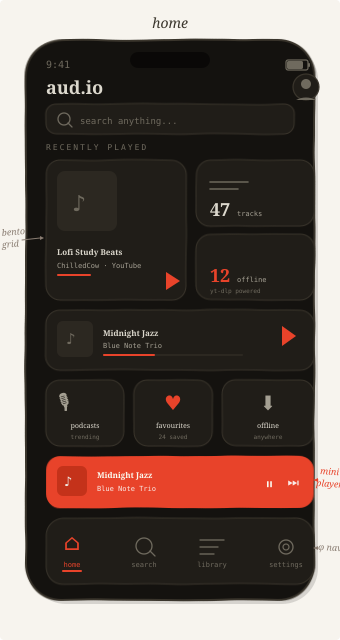
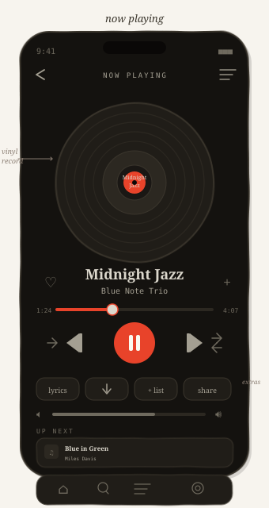
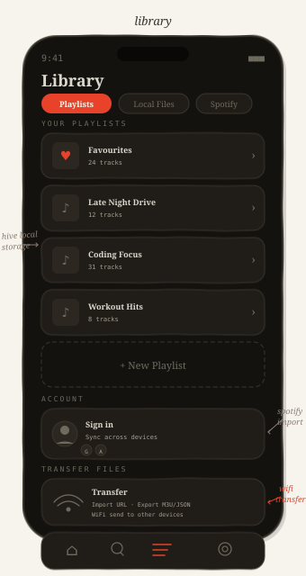
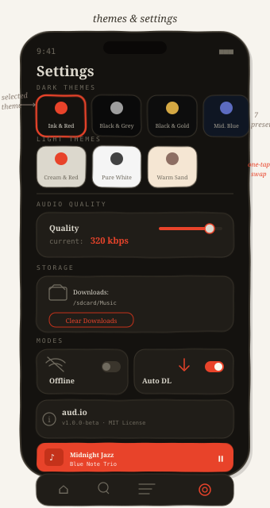
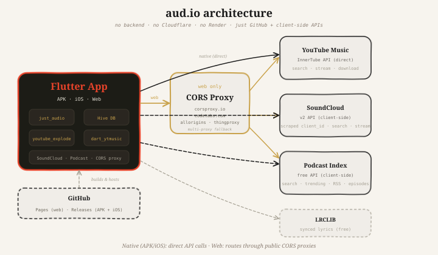

# aud.io

You know that thing where you want to listen to music but every app is either bloated, ugly, or wants your firstborn? Yeah, we fixed that.

**aud.io** is a music player that respects your eyeballs. Built with Flutter, backed by a Node.js server deployed on Cloudflare Pages + Render. Searches YouTube Music, SoundCloud, and podcasts — without selling your soul.

[](https://flutter.dev)
[](https://dart.dev)
[](https://nodejs.org)
[](LICENSE)
[](https://github.com/0giinn0/Aud.io/actions)

---

## Live

- **Web**: https://aud-io-web.pages.dev
- **Server**: https://aud-io.onrender.com

---

## Screens

<table>
<tr>
<td align="center"><br/><sub>Home — golden spiral nav + bento grid</sub></td>
<td align="center"><br/><sub>Now Playing — vinyl record + controls</sub></td>
<td align="center"><br/><sub>Library — playlists, Spotify import, transfer</sub></td>
<td align="center"><br/><sub>Settings — 7 theme presets, one-tap swap</sub></td>
</tr>
</table>

---

## Architecture

<p align="center">
  
</p>

---

## What It Does

- **Search everything** — YouTube Music via InnerTube, SoundCloud. Type a thing, get results.
- **Podcasts** — Podcast Index API powering search, trending, and episode playback.
- **Local files** — Scans your device for audio files. VLC-style. Finds your music so you don't have to dig through folders.
- **Spotify import** — OAuth login, fetch your playlists, one tap to import.
- **7 themes** — Ink & Red, Black & Grey, Black & Gold, Midnight Blue, Cream & Red, Pure White, Warm Sand.
- **Golden spiral navigation** — 4 panels arranged using the golden ratio (φ ≈ 0.618). The active section fills the major rectangle; inactive sections spiral inward showing Bauhaus-style numbered tiles.
- **Bento box UI** — Mixed-size cards with gradients, rounded corners, Fibonacci spacing.
- **Downloads** — yt-dlp powered MP3 downloads. Your music, your files.
- **Playlists & favourites** — Stored locally with Hive. No cloud required.
- **Transfer files** — Import from URL, export M3U/JSON, WiFi send to other devices.
- **Account login** — Email/password, Google, Apple. Sync when you're ready.

---

## Tech Stack

| Layer | Tech | Why |
|-------|------|-----|
| Frontend | Flutter + Provider | Cross-platform, fast, beautiful |
| Audio | just_audio + audio_service | Background playback, lock screen |
| Server | Node.js / Express | CORS bypass, API proxy, yt-dlp |
| YouTube | yt-dlp + InnerTube | Audio extraction that actually works |
| Podcasts | Podcast Index API | Free, open, no BS |
| Persistence | Hive | Fast local storage, no internet needed |
| Hosting | Cloudflare Pages + Render | Free tier is generous |

---

## Getting It Running

### What You Need

- Flutter 3.24+
- Node.js 20+

### Step 1: Start the server

```bash
cd aud.io/server
npm install
cp .env.example .env   # fill in your API keys
npm run dev
```

Server runs on `http://localhost:3000`.

### Step 2: Run Flutter

```bash
cd aud.io
flutter pub get
flutter run -d chrome
```

### Environment Variables

| Variable | What It Does |
|----------|-------------|
| `PODCAST_INDEX_API_KEY` | Podcast Index API key |
| `PODCAST_INDEX_API_SECRET` | Podcast Index API secret |
| `SOUNDCLOUD_CLIENT_ID` | SoundCloud API client ID |
| `SPOTIFY_CLIENT_ID` | Spotify app client ID |
| `SPOTIFY_CLIENT_SECRET` | Spotify app client secret |
| `SPOTIFY_REDIRECT_URI` | OAuth redirect URL |

---

## Deployment

### Server → Render

1. Push to GitHub — Render picks up `render.yaml` automatically
2. Add env vars in the Render dashboard
3. Done.

### Web → Cloudflare Pages

1. Push to `main`
2. GitHub Actions builds Flutter web
3. Deploys to Cloudflare Pages automatically
4. Add `CLOUDFLARE_API_TOKEN` as a repo secret

---

## Contributing

1. Fork it
2. `git checkout -b feat/your-thing`
3. `dart analyze lib/` must pass clean (zero errors)
4. `dart format lib/`
5. Open a PR

Design language: bento box cards, 7 theme presets, golden ratio spacing, Fibonacci sizing. If it doesn't feel right, we'll ask you to tweak it.

---

## Roadmap

- [ ] iOS / Android native builds
- [ ] Last.fm scrobbling
- [ ] Smart playlists (recently played, top tracks)
- [ ] Equalizer
- [ ] Lyrics sync improvements
- [ ] Chromecast / AirPlay
- [ ] Collaborative playlists

---

## License

MIT — do whatever you want. Just don't make another subscription music app.

---

*Built with coffee and mild sleep deprivation by people who just wanted a decent music player.*
